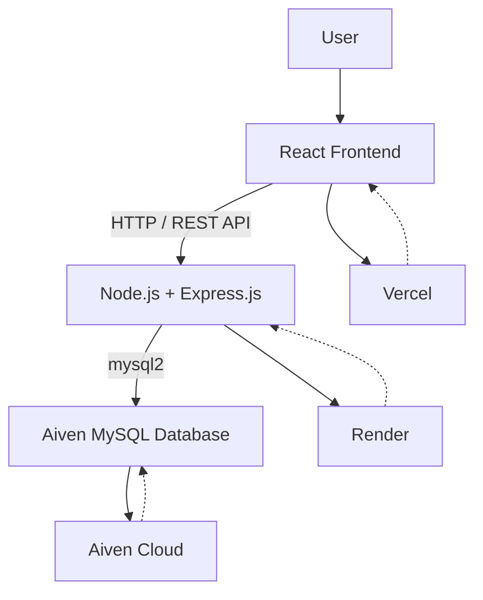

# 👨‍💻 Author

Soham Gengane
Electronics & Telecommunication Engineering Student
Full Stack Developer

# 🛒 QuickBuy!

> A full-stack e-commerce web application built with React, Node.js, Express.js, and MySQL.

QuickBuy! is a full-stack e-commerce application developed as part of a company hackathon. The application provides a complete shopping experience with product browsing, authentication, cart management, order placement, stock management, reviews, bookings, and an admin dashboard.

The project follows a modern client-server architecture where the React frontend communicates with a Node.js/Express REST API, which handles business logic and communicates with a MySQL database.

---

## 🚀 Live Demo

🌐 **Frontend:**  
https://ecommerce-hackathon-eosin.vercel.app/

🔗 **Backend API:**  
https://quickbuy-api.onrender.com

📂 **GitHub Repository:**  
https://github.com/SohamGen17/ecommerce-hackathon.git

---

## 📌 Features

### 👤 User Features

- User registration and login
- Secure password hashing using bcrypt
- JWT-based authentication
- Browse products
- View product details
- Product categories
- Add products to cart
- Update cart quantities
- Remove products from cart
- Manage delivery addresses
- Place orders
- Stock validation during checkout
- Order management
- Product reviews
- Booking functionality
- Responsive user interface

### 🛠️ Admin Features

- Admin authentication and authorization
- Admin dashboard
- Product management
- Order management
- User/order related management functionality
- Protected admin routes

### 🔐 Security Features

- Password hashing using bcryptjs
- JWT-based authentication
- Protected API routes
- Role-based authorization
- Parameterized SQL queries
- Environment variables for sensitive configuration
- CORS configuration

### 📦 Inventory & Order Management

The application performs stock validation before creating an order.

Order creation uses a MySQL transaction:

1. Start transaction
2. Lock the required product rows
3. Check product stock
4. Create the order
5. Create order items
6. Decrease product stock
7. Commit the transaction

If an error occurs, the transaction is rolled back.

This helps maintain data consistency when multiple users attempt to purchase products simultaneously.

---

# 🧑‍💻 Tech Stack

## Frontend

- React
- Vite
- JavaScript
- Tailwind CSS
- React Router
- Axios
- Context API
- Lucide React

## Backend

- Node.js
- Express.js
- REST API
- JWT
- bcryptjs
- CORS

## Database

- MySQL
- mysql2

## Deployment

- Vercel — Frontend
- Render — Backend API
- Aiven — Production MySQL Database

# 🏗️ System Architecture

# 🧠 What I Learned

Building QuickBuy! helped me gain practical experience with:

Building React applications
Component-based frontend development
React state management
React Router
REST API development
Express.js middleware
Node.js backend development
JWT authentication
Password hashing
Role-based authorization
Relational database design
SQL queries and relationships
MySQL transactions
Inventory management
API integration using Axios
Environment variable management
Git and GitHub
Cloud deployment
Debugging production applications

# 🔮 Future Improvements

Potential improvements for future versions include:

Online payment gateway integration
Product search and advanced filtering
Wishlist functionality
Email notifications
Image upload and cloud storage
Order tracking
Improved admin analytics
Automated testing
CI/CD pipeline
Docker containerization
AWS-based deployment
Improved caching and performance optimization

#🤝 Contributing

This repository is primarily maintained as a portfolio and learning project.

Suggestions, issues, and improvements are welcome.

For major changes, please open an issue first to discuss the proposed changes.
#⭐ If you found this project useful, consider giving the repository a star.
